## _Autonomous ML-based Detection & Identification of root cause for incidents in microservices running on EKS_


## Overview

Hello and welcome! My name is Cecilia, and in this amazing project, I will demonstrate how we can use machine learning (ML) to automatically find the root cause in logs generated by an application deployed in Amazon EKS.

Have you ever had the check engine light of your car turn on? The root cause for this warning could be a plethora of things; such as the transmission, ignition system, electrical wiring, and so forth.
This analogy holds true in cloud computing technology. It can be frustrating to figure out the root cause of an issue; especially when there are hundreds and even thousands of logs to filter through. To make matters worse, the growing sophistication of technology can make it even more challenging to pinpoint the root cause of an issue.

Fortunately, there's a solution!

In this project, I will show you how to install the Sock Shop microservices demo app in an EKS cluster. Then, I will demonstrate how to install the Zebrium log collector. Zebrium is a machine learning platform. Next, I will show you how to deliberately 'break' the demo app using a Chaos Engineering tool, to generate error logs in the system. Lastly, I will show you how to verify that the Zebrium platform automatically locates the root cause.

--------------------------------------------------------------------

### Part 1: Getting Started

Before we begin, we must install and/or setup the following services on our local PC:
- AWS account.
- AWS CLI (with admin privileges)
- [Zebrium](http://www.zebrium.com/sign-up) account (free trial).

#### AWS Account
If you do not already have an AWS account, please create one for free at [aws.amazon.com](https://aws.amazon.com). Once you have created an account, it is best practice to create/sign-in an IAM user on the AWS management console.

- Sign in as the IAM user.

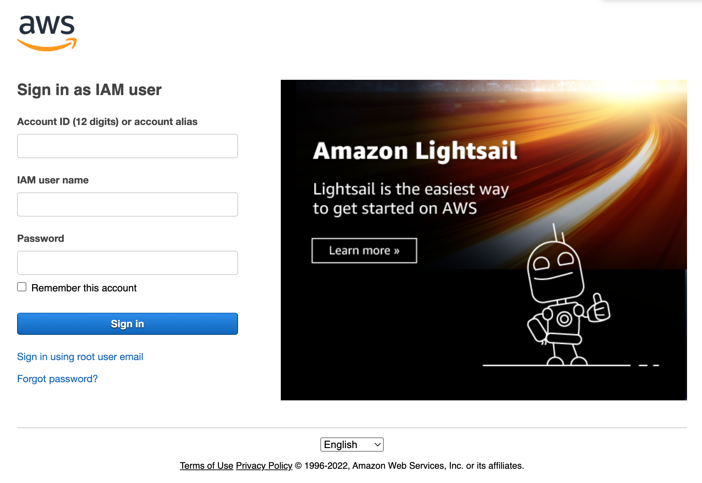

- Ensure that the IAM user has **Admin** privileges to be able to execute the setup.

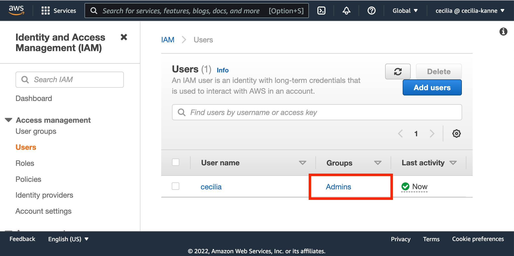

#### AWS Command Line Interface

- Next, ensure that you have installed the latest version of [AWS CLI](https://docs.aws.amazon.com/cli/latest/userguide/install-cliv2.html). Follow the guide to install the software on your local PC. Once you have installed the `AWS CLI`, check the version on Terminal using the following command:

```
$ aws --version
```

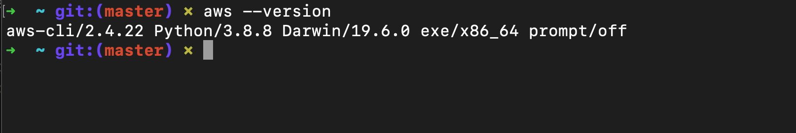

To configure your AWS account from your Terminal, use the following command, and enter your AWS credentials:

```
$ aws configure
```

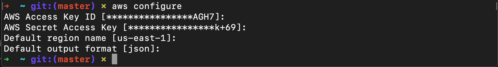


#### Create & configure an EKS cluster

On the AWS Console, navigate to the Amazon EKS service to set up and launch a cluster. Click `Add cluster` and follow the steps to create a cluster.

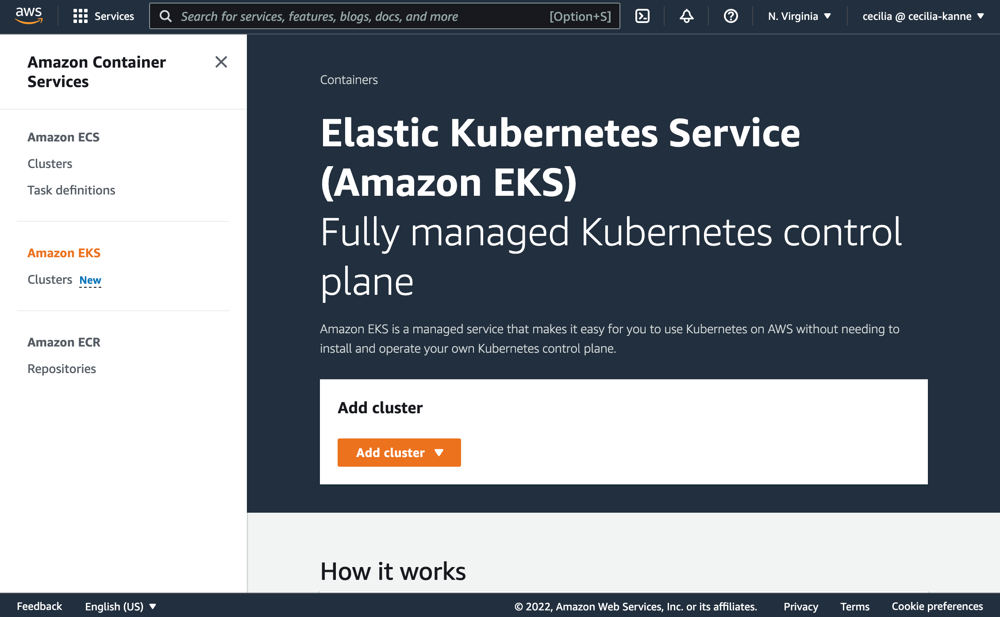

- As you create the eks cluster, follow the guided setup prompts. Be be sure to create and assign an IAM service role, so that it has permissions to execute the setup.

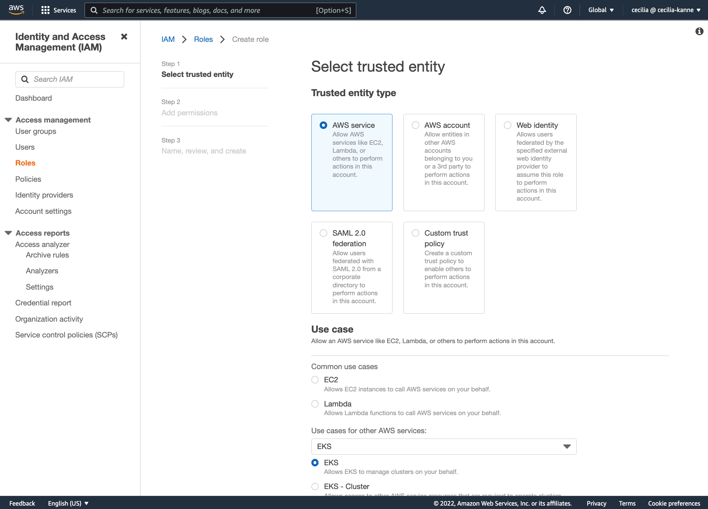

- Please be patient as the cluster is created! This process may take several minutes.

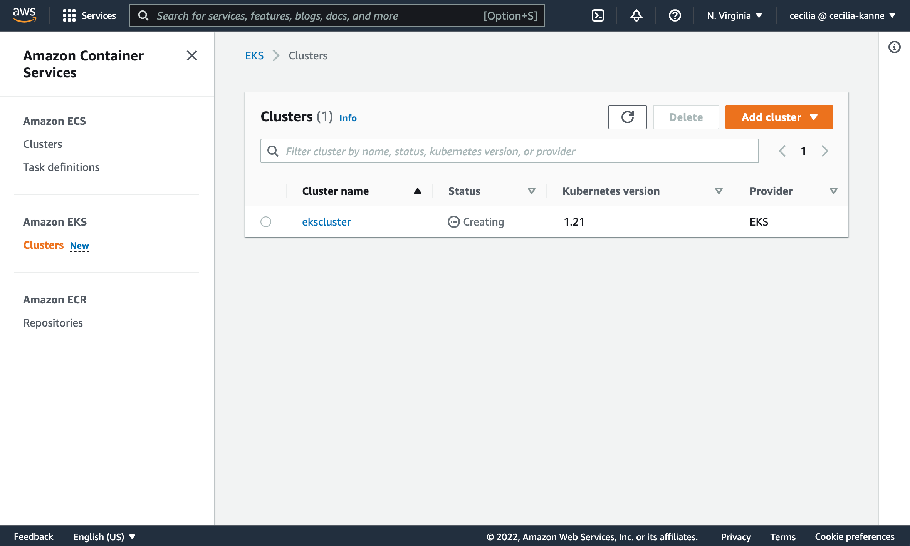 

Once it has been completed, the status will change to `Active`.


Once it has been created, add permissions to the cluster by creating a **nodegroup**. Here is the procedure:

- Navigate to the IAM service on the AWS Management Console and select the `Roles` section within the **Access Management** category. 

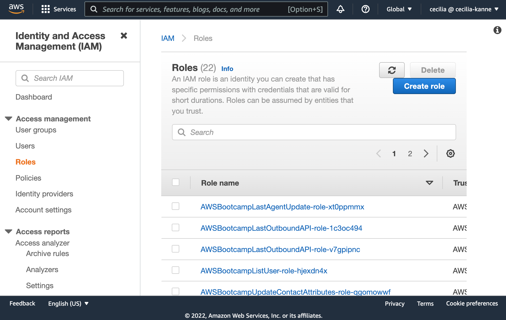

- Next, select `AWS Service` and then select `EC2` as the use case.

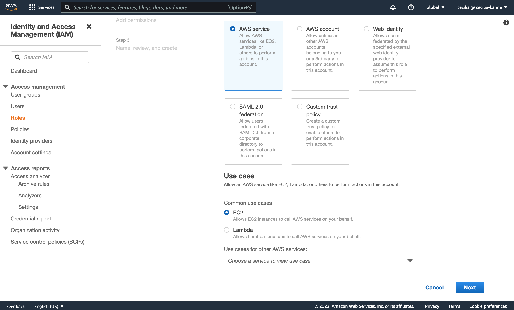

- Next, add each of the following permission policies:

      AmazonEKSWorkerNodePolicy
      AmazonEKS_CNI_Policy
      AmazonEC2ContainerRegistryReadOnly

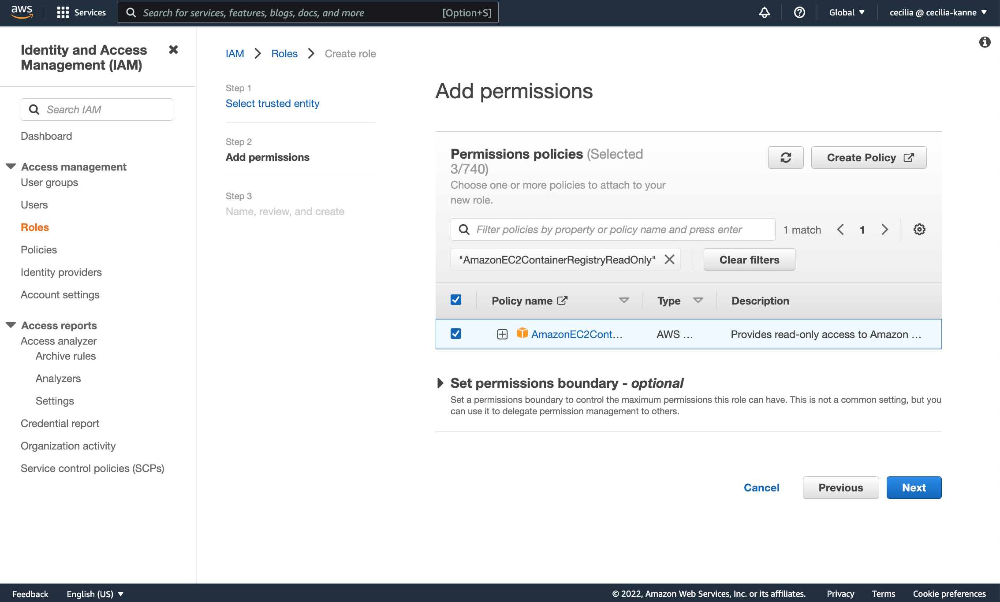

- On the next page, make sure that all of the permissions have been added!

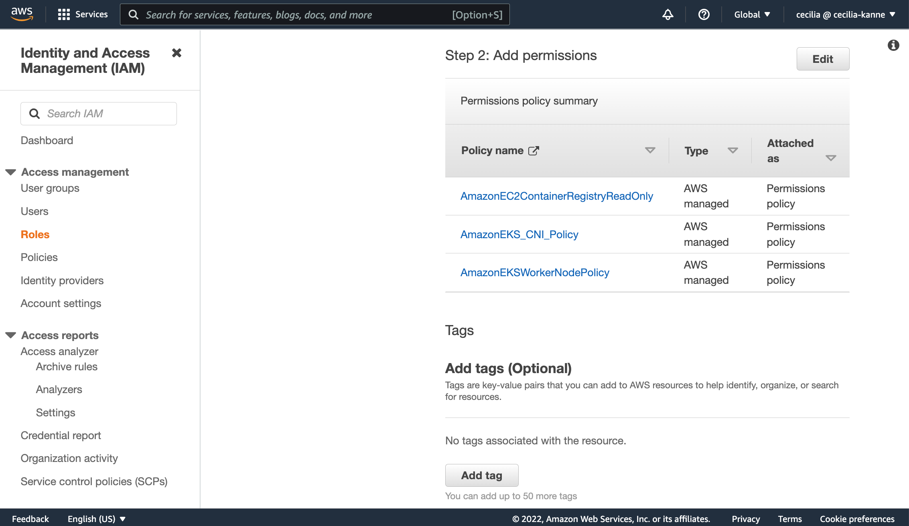

- Next, enter your preferred Role Name and/or Description. Then, once you have created the role name, you will see a confirmation banner on the top of your screen, as shown here:

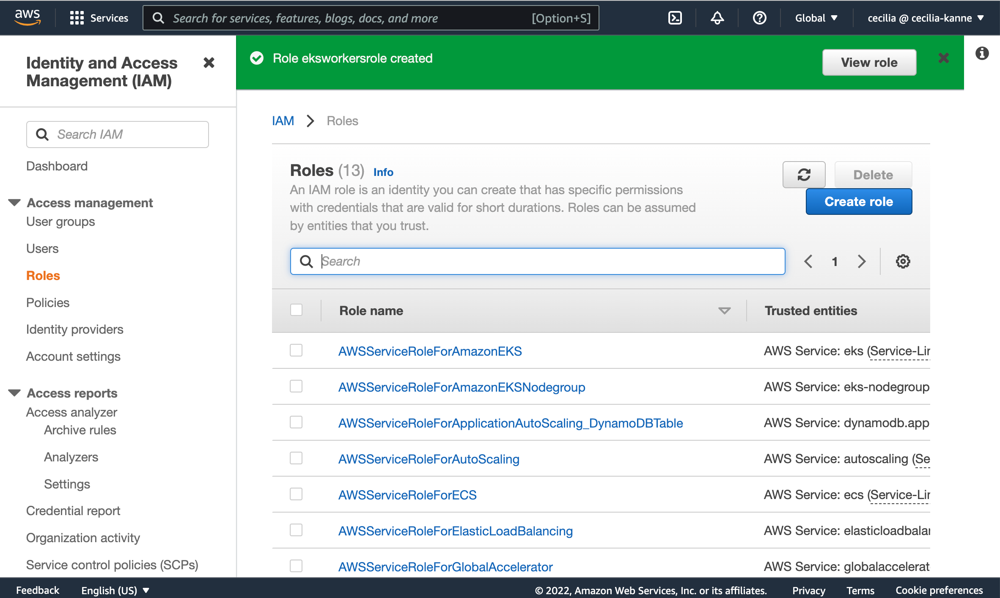


- After you have completed the steps, navigate back to the cluster on `Amazon EKS`. Click the `Compute` tab and then select `Add Node Group`. 

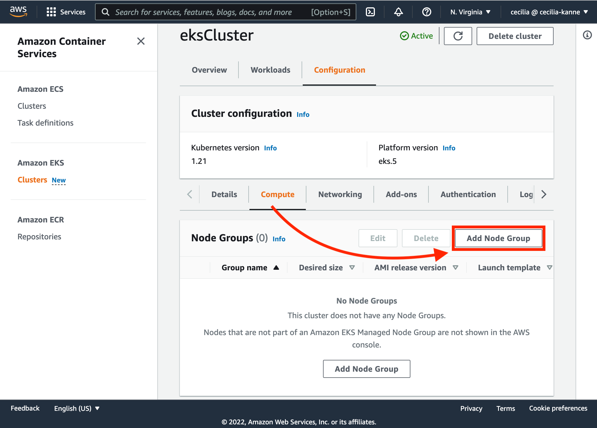

- Next, begin to configure and add the newly created node group to your cluster. 

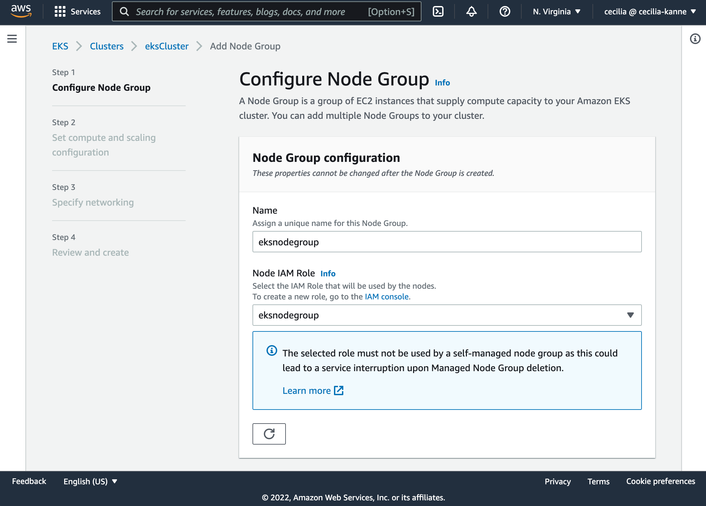

- Once you have added it, you should see the node group in your cluster:

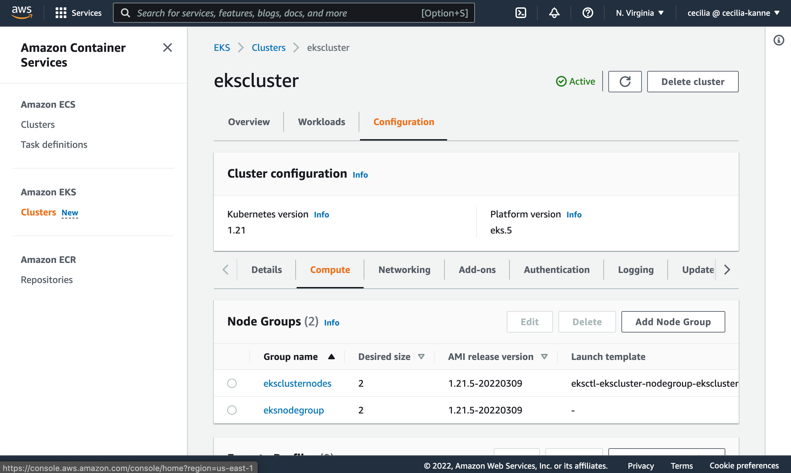


#### Create a Zebrium account & install the log collector

Create a new [Zebrium account](https://cloud.zebrium.com/auth/sign-up) with a free 30-day trial. As you create your account, set your name, email, and password. Once you have signed up, then navigate to the `Log Collector Setup` page.

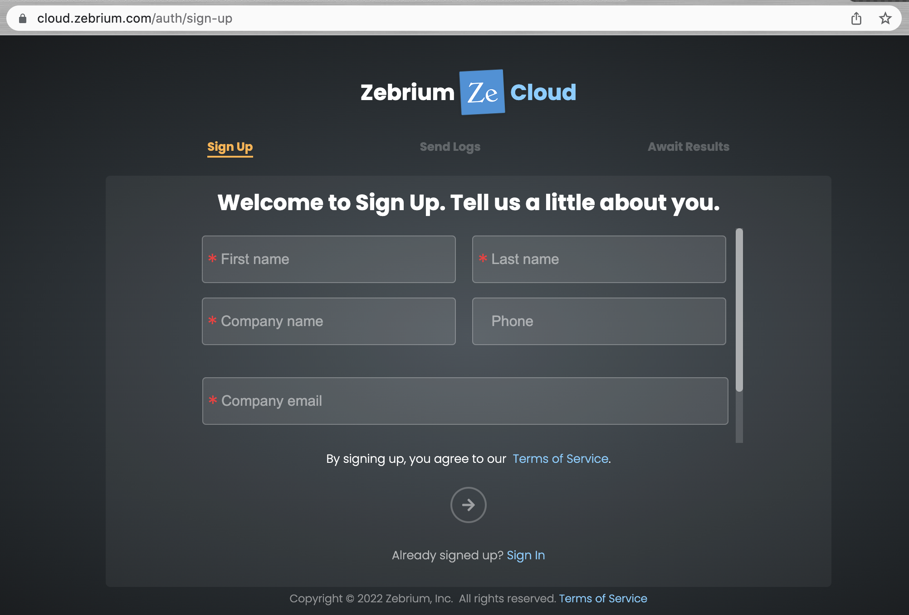

- On the `Log Collector Setup` page, copy the Helm  command from the Zebrium Send Logs page.

**IMPORTANT:** _Do not install the log collector just yet! We will modify it in the upcoming steps._

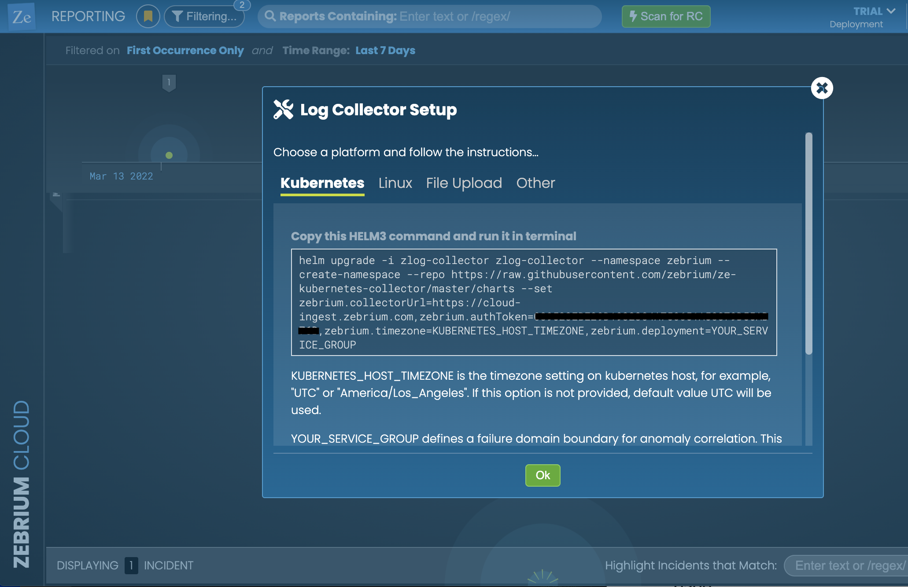

- In the Helm command you copied, delete the following parts of the line:

```bash
zebrium.timezone=KUBERNETES_HOST_TIMEZONE
zebrium.deployment=YOUR_SERVICE_GROUP
```

Below is an example of the Helm command with the deleted portions (_make sure to substitute XXXX for your actual token_):

```
$ helm upgrade -i zlog-collector zlog-collector --namespace zebrium --create-namespace --repo https://raw.githubusercontent.com/zebrium/ze-kubernetes-collector/master/charts --set zebrium.collectorUrl=https://cloud-ingest.zebrium.com,zebrium.authToken=XXXX
```

After you run the Helm command in Terminal, the Zebrium UI should detect that logs have been received. The Zebrium pop-up will look something like this:

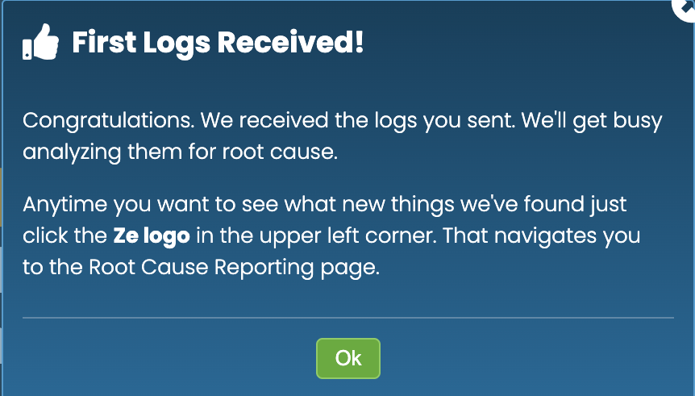


Excellent work! We have completed the Zebrium installation and setup. 


**TROUBLESHOOTING**

If for some reason, you do _**not**_ see the logs appear, try using a different method to install Zebrium on your Terminal.

**Installing via kubectl**

- The commands below install the Zebrium log collector as a Kubernetes DaemonSet:

```
$ kubectl create secret generic zlog-collector-config --from-literal=log-collector-url=YOUR_ZE_API_URL
--from-literal=auth-token=YOUR_ZE_API_AUTH_TOKEN
```

Be sure to replace `YOUR_ZE_API_URL` and `YOUR_ZE_API_AUTH_TOKEN` with the corresponding information.

- Next, run the following command:

```
$ kubectl create -f https://raw.githubusercontent.com/zebrium/ze-kubernetes-collector/master/templates/zlog-collector.yaml
```

After a few minutes, the logs should be viewable on Zebrium web UI.

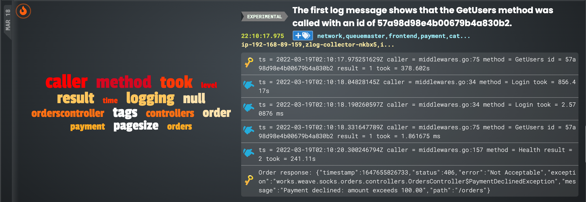


If you still do not see any logs, navigate to the main reporting page. There is a green button at the top that says **Scan for RC (Root Cause)**:

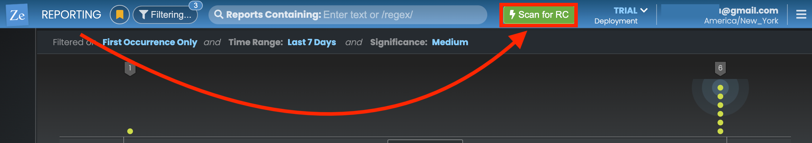

Once you click on this button, it will pop up a time and date picker. You can then select an approximate time of the problem to troubleshoot.

The results of the scan should appear as a new root cause report a few minutes later (_remember to refresh the screen to see it_).

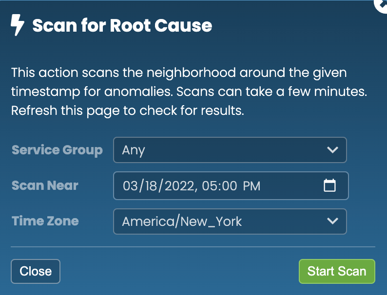


--------------------------------------------------------------------

### PART 2: Install & launch the Sock Shop app

Now that we have set up our Kubernetes environment, we will utilize Zebrium's machine learning platform to detect and learn the log patterns.

The demo microservices app that we will use is called [Sock Shop](https://microservices-demo.github.io/). This demo app simulates the key components of the user-facing part of an e-commerce website. It is built using components such as Spring Boot, Go kit, and Node.js. It is also packaged in Docker containers.

- To begin, install Sock Shop from a .yaml file using the following command: 

```bash
$ kubectl create -f https://raw.githubusercontent.com/zebrium/zebrium-sockshop-demo/main/sock-shop-litmus-chaos.yaml
```

**PLEASE NOTE**: _Please be patient as the pods are being created. **DO NOT** move on to the next step until all pods are in a `Running` state_

- Check the status of the pods using the following command:

```
$ kubectl get pods -n sock-shop
```

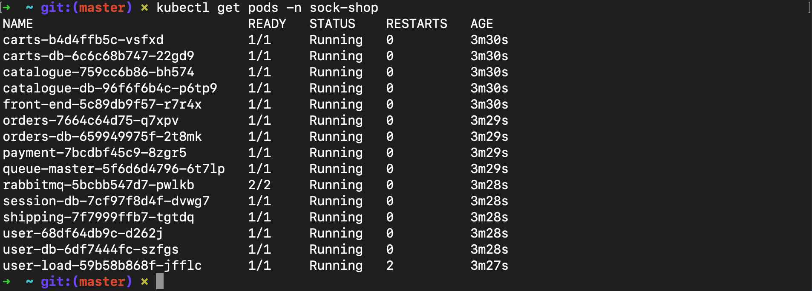


Once all the services are running, you can visit the app on your web browser! In order to achieve this, we must set up port forwarding, then get the front-end IP address and port.

- Run the command below in a separate shell window:

```bash
$ kubectl get pods -n sock-shop | grep front-end
```

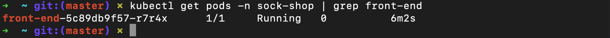

- Next, use pod name from the above command in place of XXX’s

```
$ kubectl port-forward front-end-XXXX-XXXX 8079:8079 -n sock-shop
```

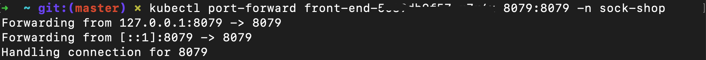


- Now open the `ip_address:port` from above (in this case: 127.0.0.1:8079) in a new tab on your web browser! You should now be able to interact with the Sock Shop app. Navigate the website and verify that it is working correctly.

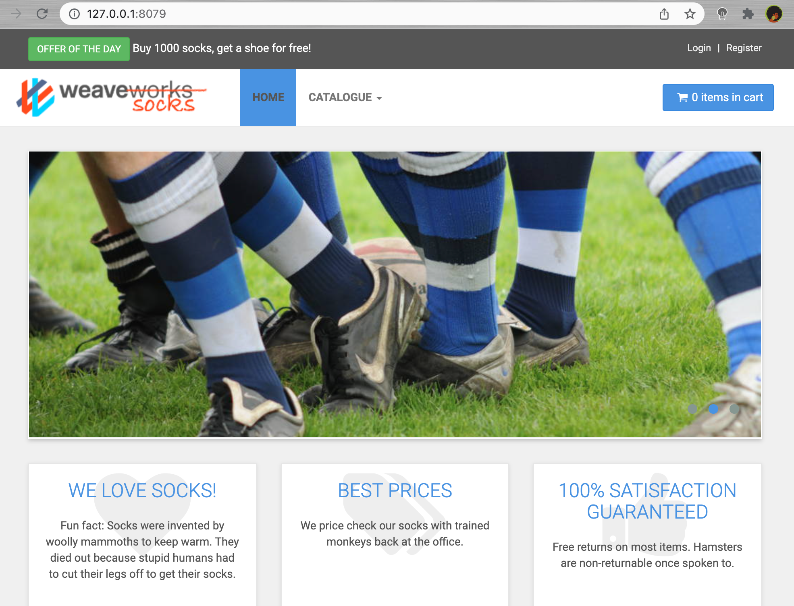

--------------------------------------------------------------------

### PART 3: Install the Litmus Chaos Engine

In this section, we are going to install and use the [Litmus Chaos Engine](https://litmuschaos.io/) to deliberately “break” the functionality of the Sock Shop application. 

- Begin by installing the Litmus Chaos components as well as create an appropriate role-based access control (RBAC) for the pod-network-corruption test:

```bash
$ helm repo add litmuschaos https://litmuschaos.github.io/litmus-helm/

$ helm upgrade -i litmus litmuschaos/litmus-core -n litmus --create-namespace
```


- Continue the instillation using the following command:

```
$ kubectl apply -f "https://hub.litmuschaos.io/api/chaos/1.13.6?file=charts/generic/experiments.yaml" -n sock-shop
```

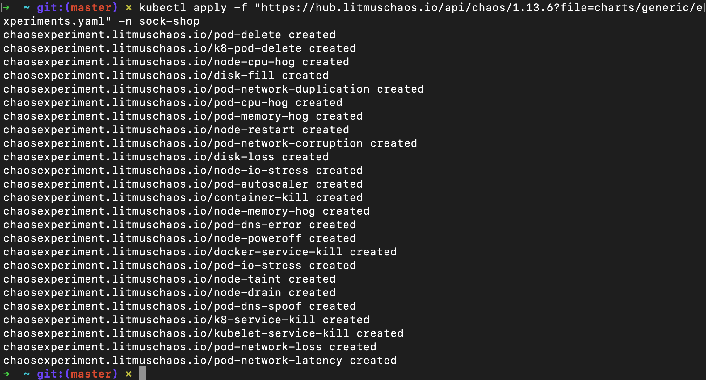

- Next, setup a service account with the appropriate RBAC to run the network corruption experiment using the following command:

```
$ kubectl apply -f https://raw.githubusercontent.com/zebrium/zebrium-sockshop-demo/main/pod-network-corruption-rbac.yaml
```

- Lastly, make note of the time using the following command:

```
$ date
```

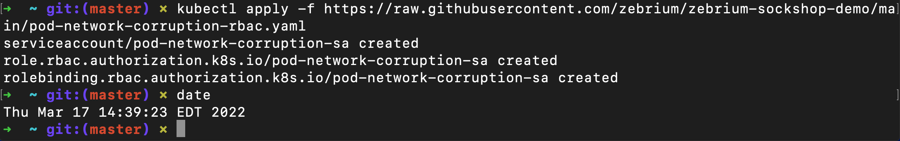

-----------------------------------------------------------------

### PART 4: Generating Machine-Learning Logs

In this section, we will take at least 2 hours for baseline log data collection. The reason for this is because we have just created our new EKS cluster, new app, and new Zebrium account. We must allow the Zebrium ML platform enough time to recognize normal log patterns.


In the meantime, you can explore the Zebrium UI on your web browser. Explore and interact with Root Cause Reports! There should see at least one sample root cause report, as shown below:

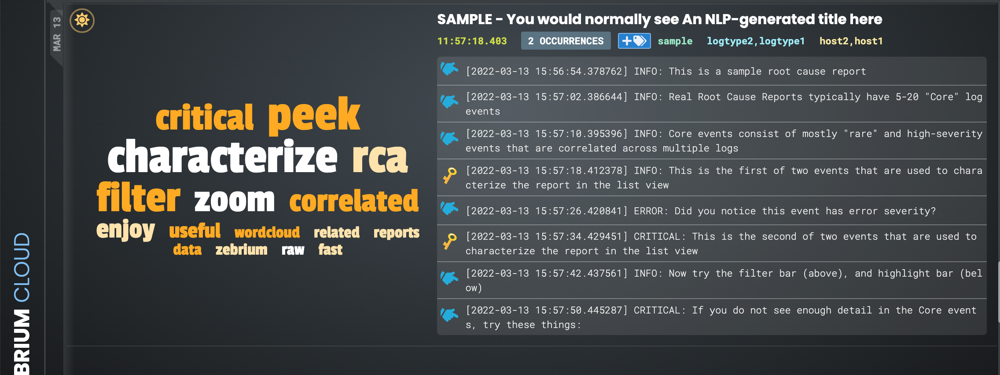

--------------------------------------------------------------------

### PART 5: Break The Sock Shop


Now that at least 2 hours have elapsed, the Zebrium ML platform has had enough time to gather a baseline of the logs. We will deliberately disrupt our environment by running a Litmus network corruption chaos experiment.

- Begin by running the following command to start the network corruption experiment:

```bash
$ kubectl apply -f https://raw.githubusercontent.com/zebrium/zebrium-sockshop-demo/main/pod-network-corruption-chaos.yaml
```
- Be sure to make note of the date:

```
$ date
```

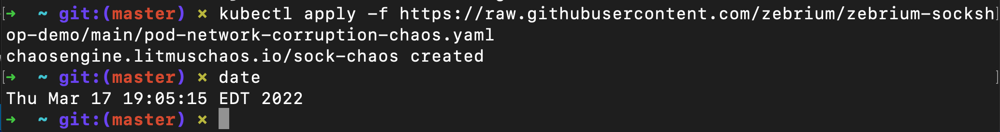


- It will take a moment for the `pod-network-corruption-helper` to reach a Running state. Check the status of it by using the following command:

```bash
$ kubectl get pods -n sock-shop -w
```
**PLEASE NOTE**: Type `^C` to stop the kubectl command

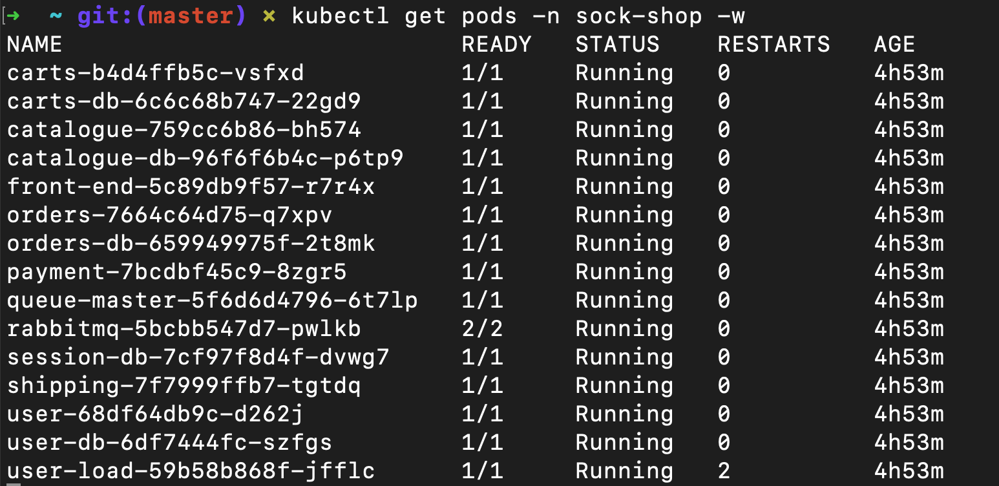

As soon as the the Chaos experiment has started running, you can go to back to the Sock Shop UI on your web browser. You should still be able to navigate around the website, however you may notice some operations will fail.

In my case, I was unable to add additional items into my shopping cart. As a result, the quantity of items in my shopping cart would not increment correctly.

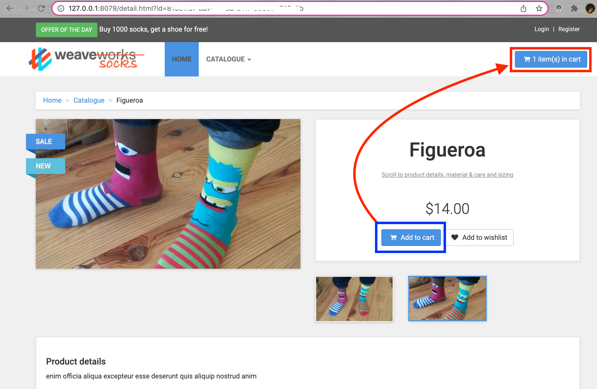

**PLEASE NOTE:** _The chaos experiment will run for two minutes. Please wait for it to complete before proceeding to the next step._

--------------------------------------------------------------------

### PART 6: Results & Interpretation

Now that the chaos experiment is complete, please allow some time for the Zebrium ML platform to detect the errors. This may take up to 10 minutes. **_Manually refresh your web browser window until you see new root cause reports_**.

The type of errors that appear are based on a combination of many factors. This includes the learning period, the events occurred while learning, and the timing/order of the log lines while the experiment was running, and so forth.

The reporting page contains a summary list of all the root cause reports found by the machine learning. There are _three_ useful parts of the summary:

1. **Plain language NLP summary** 
This is an experimental feature where we use the [GPT-3 language model](https://www.zebrium.com/blog/using-gpt-3-with-zebrium-for-plain-language-incident-root-cause-from-logs) to construct a summary of the report. The summary provides some useful context about the problem.


2. **Log type(s) and host(s)**
The log type and host (front end, events, orders, and messages) that contain the events for the incident.

3. **“Hallmark” events**
The ML picks out one or two events that it believes will define the problem.

After running the Chaos experiment, Zebrium generated a series of reports. Here is a summary of the root cause errors that were generated in my Zebrium account:

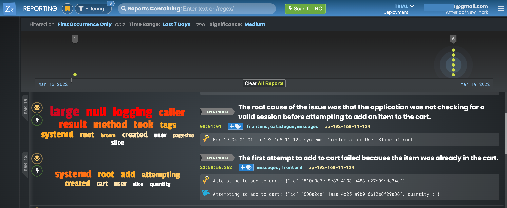


Let's take a closer look! One of my errors was as follows:

_**"The first attempt to add to cart failed because the item was already in the cart"**_.

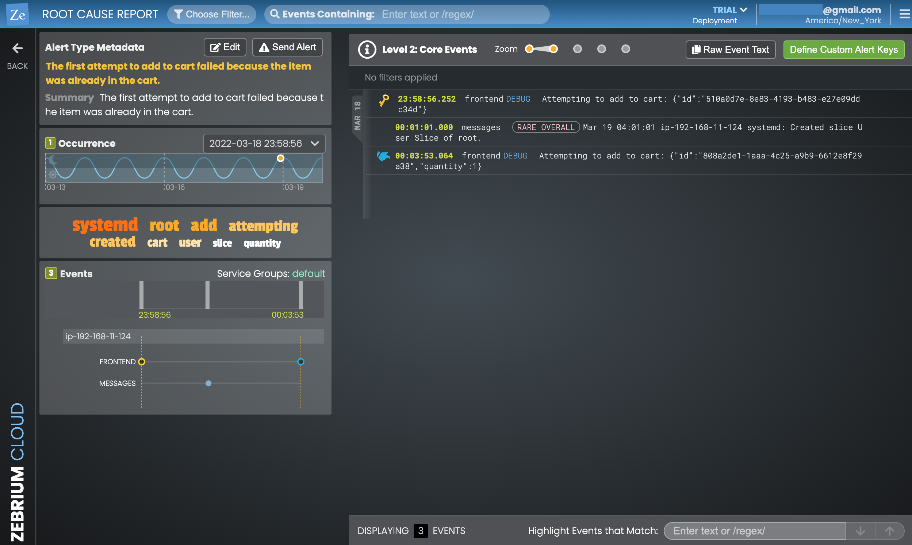


The displayed core events represent the cluster of correlated anomalies that the Zebrium ML selected. I zoomed-in to view more details of the root cause report. 

Each zoom level displays additional surrounding errors and anomalies that the Zebrium ML believes are related. Here are the logs I observed after I  clicked on the next zoom level:


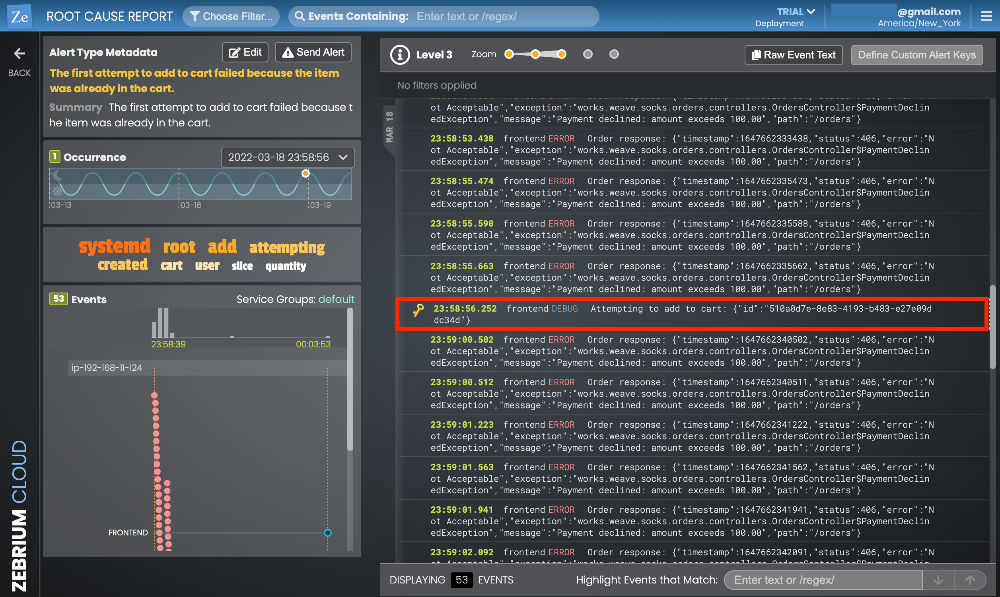


In my case, I observed over 53 events! I have highlighted the key event that explain the root cause of the problem!

The second error that I observed was as follows:

**_"The root cause of the issue was that the application was not checking for a valid session before attempting to add an item to the cart"_**.

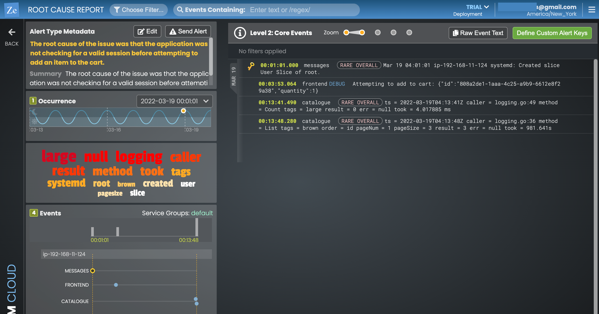

Once again, I zoomed-in to view more details of the root cause report.

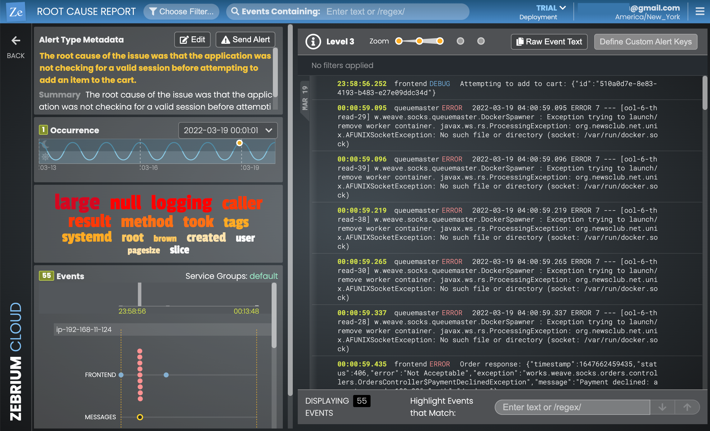

In this project, we utilized the principles of Chaos Engineering to deliberately "break" the Sock Shop microservices application. The Zebrium machine learning technology was able to detect this and build a root cause report that detailed the root cause.

The Zebrium ML platform was able to detect and outline the root cause of the issue. This powerful technology is demonstrate how  machine learning can be used to automatically detect anomalies within a set of log lines and define the root cause.


--------------------------------------------------------------------

### Clean Up

Nice work! Now we will begin the clean up process, so that we can prevent charges from prolonged usage of our resources.

- Begin by navigating to the `Amazon EKS` service and click the `Clusters` section on the AWS management console. Next, in the `configuration` tab, select the `compute` tab and then delete the node groups individually.

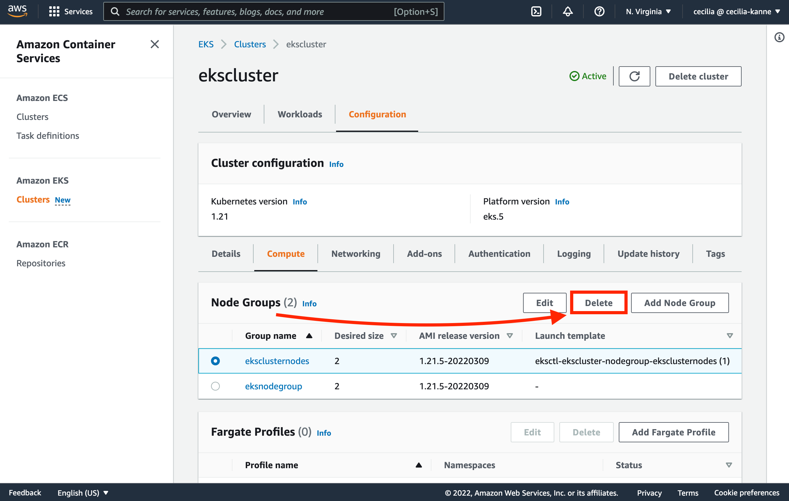


- You will be prompted to confirm whether or not you want to delete the node groups. Confirm by typing the name of the node group, then click `Delete`.

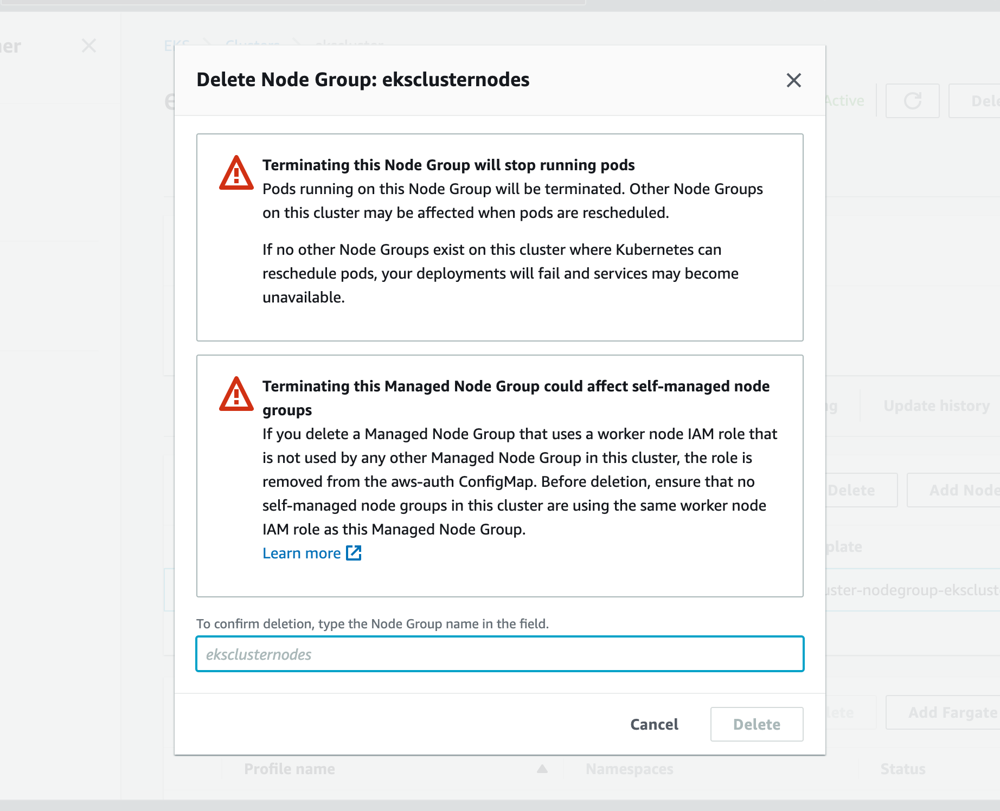


- The termination process will begin. It may take several minutes.


- After the node groups have been deleted, click `Delete cluster` to delete the eks cluster.

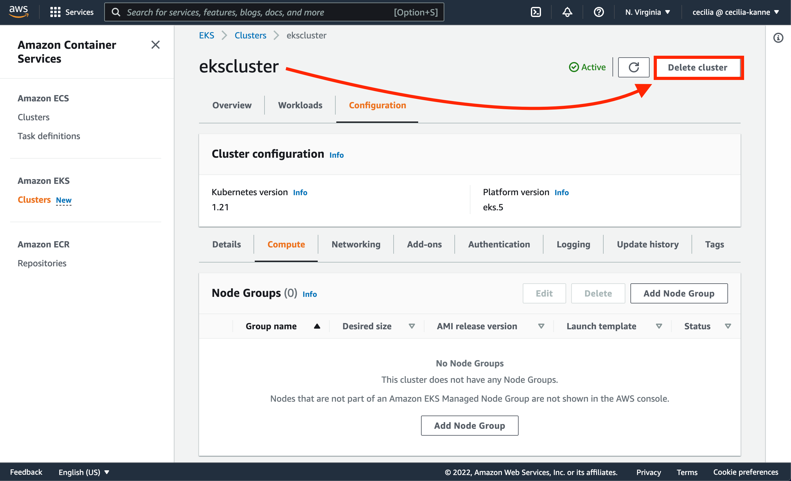

- Once again, you will be prompted to confirm whether or not you want to delete the cluster. Confirm by typing the name of the cluster, then click `Delete`.

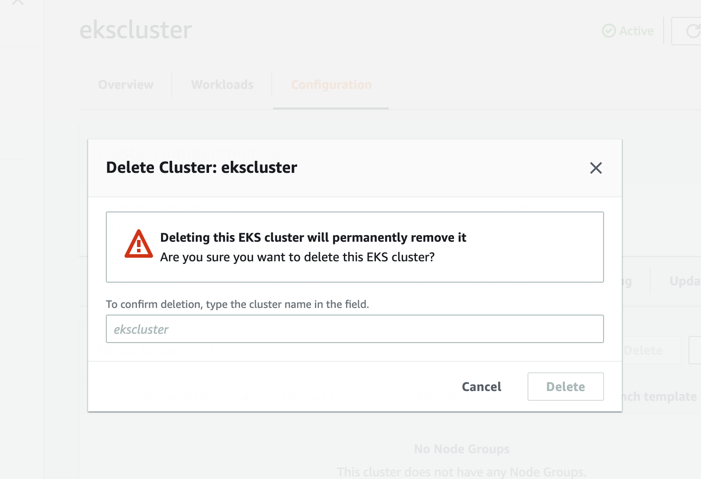


- The termination process will begin. It may take several minutes. Please be patient!

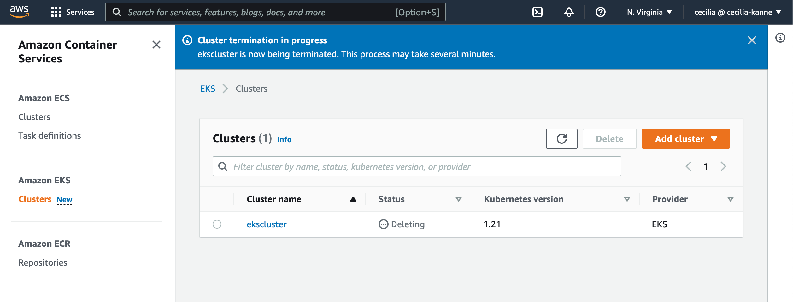


- Refresh the page to confirm that the cluster has been deleted.

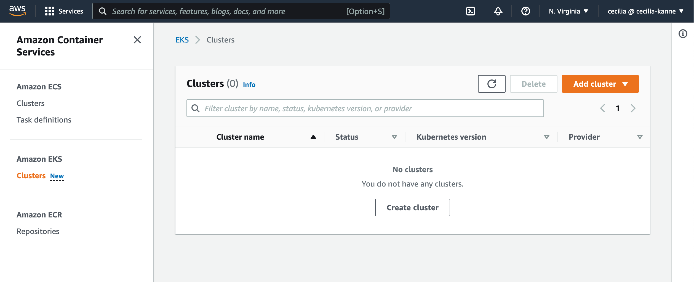


----------------------------------------------------------------------

Great job! Thank you for viewing my project and following along. I hope you enjoyed it! For more details on similar projects and more, please visit my GitHub portfolio: https://github.com/ceciliacloud


# Detecing-incidents-eks-microsvcs
